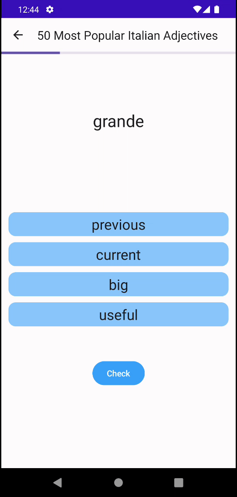
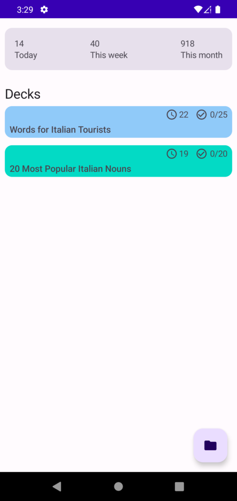

# Lingua

A language learning app designed to help users improve their language skills. The app includes
features such as creating decks, adding cards to decks, and practicing decks.

The app is built using Jetpack Compose and Kotlin.

I'm writing a series on my blog describing my journey building this app.

- [Building a Language Learning App with Compose – Part 1](https://victorbrandalise.com/building-a-language-learning-app-with-compose-part-1)
- [Building a Language Learning App with Compose – Part 2](https://victorbrandalise.com/building-a-language-learning-app-with-compose-part-2)
- [Building a Language Learning App with Compose – Part 3](https://victorbrandalise.com/building-a-language-learning-app-with-compose-part-3)

## Demo

